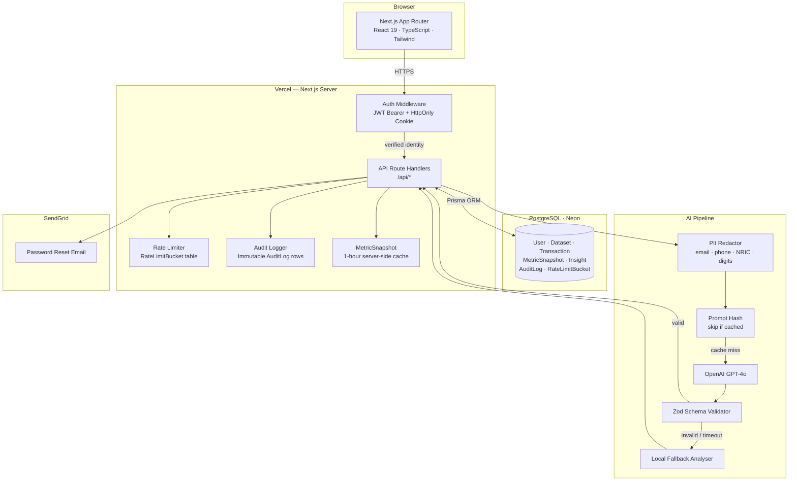

# InsightStack — AI-Powered Finance Analytics

> Upload your transactions. Understand your spending. Get AI-driven recommendations.

[](https://github.com/anishonly121/insightstack-blueprint/actions/workflows/ci.yml)


InsightStack is a **production-grade full-stack web application** that turns raw CSV bank exports into a visual financial dashboard with OpenAI-generated spending insights. Built end-to-end with authentication, rate limiting, audit logging, caching, structured logging, 29 integration tests and a Playwright E2E suite — no mocks.

**[Live Demo →](https://insightstack-peach.vercel.app)** · **[How It Works](https://insightstack-peach.vercel.app/demo)** · **[About the Project](https://insightstack-peach.vercel.app/about)**

[](https://vercel.com/new/clone?repository-url=https%3A%2F%2Fgithub.com%2Fanishonly121%2Finsightstack-blueprint&root-directory=app)

---

## Table of Contents

- [Screenshots](#screenshots)
- [How It Works](#how-it-works)
- [Architecture](#architecture)
- [Engineering Highlights](#engineering-highlights)
- [Design Tradeoffs](#design-tradeoffs)
- [Tech Stack](#tech-stack)
- [Features](#features)
- [Database Schema](#database-schema)
- [API Reference](#api-reference)
- [Getting Started](#getting-started)
- [Running Tests](#running-tests)
- [Deployment](#deployment-vercel--neon)
- [Project Structure](#project-structure)

---

## Screenshots

> **[Try the live app →](https://insightstack-peach.vercel.app)** — sign up free, upload `docs/demo-transactions.csv`, and generate AI insights in under 60 seconds.

| Landing Page | Dashboard | AI Insights |
|---|---|---|
|  |  |  |

---

## How It Works

| Step | What Happens |
|------|-------------|
| 1. Register / Login | JWT-authenticated account with HttpOnly cookie support |
| 2. Create a Dataset | Named container for a CSV upload |
| 3. Upload CSV | Parse, validate, and store transaction rows in PostgreSQL |
| 4. View Dashboard | Income vs. expenses, savings rate, monthly bar chart, category pie chart |
| 5. Search Transactions | Filter by category or search description with server-side pagination |
| 6. Generate AI Insights | GPT-4o analyses spending — returns summary, anomalies, top categories, 3 recommendations |

---

## Architecture



---

## Engineering Highlights

These are the design decisions that go beyond a typical tutorial project:

**AI pipeline resilience** — Before hitting OpenAI, transactions are PII-redacted (email, phone, long digit strings), capped at 100 rows / 50k characters, and the prompt is hashed. Identical data reuses the cached result, skipping the API call entirely. If OpenAI returns malformed JSON or is unavailable, a local fallback analyser runs against the same data — the user always gets a response.

**MetricSnapshot caching** — Analytics are computed server-side once and stored as a `MetricSnapshot` row in PostgreSQL with a 1-hour TTL. Subsequent dashboard loads read directly from the snapshot instead of re-aggregating thousands of transaction rows on every request.

**DB-backed rate limiting without Redis** — A `RateLimitBucket` table (keyed by action + user ID + IP) handles per-user and per-IP rate limits with opportunistic row cleanup. No external queue or cache dependency required.

**Dual auth strategy** — Every protected route accepts both a `Bearer` JWT header *and* an HttpOnly cookie simultaneously. API clients use the header; browser page navigations use the cookie. The same middleware handles both without duplication.

**Real integration tests** — Tests spawn an actual `next start` process, poll `/api/health` until ready, and run against a live PostgreSQL database. No mocks. This caught real regressions during development that unit tests would have missed (e.g., Prisma query shape changes, JSON serialisation edge cases).

**Immutable audit log** — Every sensitive action (upload, rename, delete, insight generate) appends a row to `AuditLog`. Rows are never updated or deleted. The daily insight quota is enforced by counting AuditLog entries rather than a mutable counter that could drift under concurrent requests.

**Zod on AI output boundaries** — GPT-4o returns freeform JSON. Schema-validating every response means a malformed reply triggers the local fallback, never a runtime crash. The same Zod schemas are used for both request validation and AI response validation.

**Structured JSON logging** — All API-layer errors and key events (`INSIGHTS_PROMPT_STATS`, `RATE_LIMIT_CLEANUP_ERROR`, etc.) are emitted via a typed logger that outputs JSON in production (for log aggregators) and human-readable lines in development. Correlation IDs flow through every log entry.

**Playwright E2E suite** — Beyond the 29 integration tests, a Playwright browser-level suite drives the full user journey: landing page → register → create dataset → upload CSV → verify PARSED status → navigate to dataset detail. Runs headlessly against localhost or the live deployment.

**URL-based SSL detection** — Rather than branching on `NODE_ENV` (which is `'production'` in CI too), SSL is detected by checking the connection string for `'localhost'` — a more reliable signal across local, CI, and production environments.

---

## Design Tradeoffs

Every architectural decision has a cost. These are the ones worth discussing in an interview:

**PostgreSQL for rate limiting instead of Redis** — Adds one write per rate-limited endpoint. Acceptable at this scale and eliminates a Redis dependency. At >1k concurrent users, the `RateLimitBucket` table becomes a write bottleneck and Redis would be the right call.

**No mock tests** — Integration tests are slower (30–60s total) and require a live database. This is deliberate. Mocks test that your mock matches your expectations, not that your code works. A real test caught a Prisma query-shape regression mid-development that a unit test would have silently passed.

**MetricSnapshot instead of live aggregation** — Computing dashboard metrics on every page load means scanning all `Transaction` rows per request. The 1-hour snapshot cache trades freshness for constant-time reads. Acceptable for personal finance (yesterday's data is fine); wrong for trading dashboards.

**JWTs instead of server-side sessions** — Sessions require shared state (Redis or a DB table). JWTs are stateless and work naturally across Vercel's serverless functions with no coordination. The tradeoff: tokens can't be revoked before expiry. Mitigated by short TTLs and the HttpOnly cookie path clearing on logout.

**Daily insight quota via AuditLog counting** — Rather than a mutable `insightCount` column that could go wrong under concurrent requests, the quota is enforced by counting immutable AuditLog rows. The count is always accurate; there's no race condition; the log is a useful audit trail regardless.

**Zod at the AI response boundary** — GPT-4o returns freeform JSON. Rather than trusting it, every response is validated against a strict Zod schema. A malformed response triggers the local fallback — the user always gets an answer, even if OpenAI is having a bad day.

---

## Tech Stack

| Layer | Technology |
|-------|-----------|
| Framework | Next.js 16 (App Router, TypeScript) |
| Database | PostgreSQL via [Neon](https://neon.tech) |
| ORM | Prisma 7 |
| Auth | JWT + bcryptjs + HttpOnly cookies |
| Validation | Zod (request bodies + AI response schema) |
| CSV Parsing | Papa Parse |
| Charts | Recharts (Pie, Bar, Line) |
| Styling | Tailwind CSS v4 |
| AI | OpenAI GPT-4o |
| Email | SendGrid (password reset) |
| Testing | Node.js built-in test runner (29 integration tests) |
| CI | GitHub Actions (lint + type-check + build + migrate + 29 integration tests) |
| E2E | Playwright (8 tests — auth flow, upload, dataset detail) |
| Deployment | Vercel |

---

## Features

### Authentication
- Register, login, logout, forgot password, reset password via email
- JWT signed tokens + HttpOnly cookie auth (both supported simultaneously)
- bcrypt password hashing (10 rounds)
- Enumeration-safe forgot-password response (same response whether email exists or not)
- Role-based access control: `USER` / `ADMIN`

### Dataset Management
- Create, list (paginated), view, rename, delete datasets
- CSV upload with row-level validation — bad rows skipped, good rows inserted atomically via Prisma transactions
- Dataset status: `UPLOADED` → `PARSED` / `FAILED`

### Analytics & Metrics
- Server-computed `MetricSnapshot` per dataset: total income, total expenses, net savings, savings rate, avg transaction, top categories, monthly breakdown
- Results cached for 1 hour — no redundant aggregation queries
- Three charts: category pie, monthly income/expense bar, net savings trend line
- One-click CSV export of filtered transactions

### AI Insights
- PII redaction before sending to OpenAI (email, phone, NRIC, long digit strings)
- Payload capped at 100 transactions / 50k characters
- Response schema-validated with Zod — local fallback analysis if OpenAI fails
- Results cached by prompt hash — identical data skips the API call
- Daily quota of 30 insights per user (enforced via AuditLog counting)
- Structured output: summary, top categories with reasons, anomalies, 3 recommendations

### Security
- CSP, X-Frame-Options, X-Content-Type-Options, Referrer-Policy, Permissions-Policy headers
- CSRF enforcement for cookie-authenticated mutations
- JSON body hardening: `415` on wrong Content-Type, `400` on malformed JSON
- Request correlation IDs on all requests and error responses
- Immutable AuditLog for all sensitive actions
- DB-backed rate limiting (no Redis required)

### Admin Panel
- View all users and datasets across the platform
- Admin-scoped dataset deletion
- Accessible only to users with `ADMIN` role

---

## Database Schema

```
User ──< Dataset ──< Transaction
              └──< MetricSnapshot
              └──< Insight
User ──< AuditLog
User ──< PasswordResetToken
RateLimitBucket (keyed by action + user + IP)
```

---

## API Reference

### Auth
| Method | Path | Description |
|--------|------|-------------|
| `POST` | `/api/auth/register` | Create account → returns JWT |
| `POST` | `/api/auth/login` | Login → returns JWT + sets HttpOnly cookie |
| `GET` | `/api/auth/me` | Get current user (Bearer or cookie) |
| `PATCH` | `/api/auth/me` | Change password (requires current password) |
| `DELETE` | `/api/auth/me` | Delete account + all data (requires password confirmation) |
| `GET` | `/api/auth/me/quota` | Today's insight usage vs. 30/day limit |
| `POST` | `/api/auth/logout` | Clear auth cookie |
| `POST` | `/api/auth/forgot-password` | Send password reset email |
| `POST` | `/api/auth/reset-password` | Consume reset token, set new password |

### Datasets
| Method | Path | Description |
|--------|------|-------------|
| `POST` | `/api/datasets` | Create dataset |
| `GET` | `/api/datasets` | List datasets (paginated, sorted) |
| `GET` | `/api/datasets/:id` | Get dataset + transaction stats |
| `PATCH` | `/api/datasets/:id` | Rename dataset |
| `DELETE` | `/api/datasets/:id` | Delete dataset (cascades) |
| `POST` | `/api/datasets/:id/upload` | Upload + parse CSV |
| `GET` | `/api/datasets/:id/metrics` | Get computed MetricSnapshot (1hr cache) |
| `GET` | `/api/datasets/:id/transactions` | List transactions (search, filter, paginate) |
| `POST` | `/api/datasets/:id/insights` | Generate AI insight |
| `GET` | `/api/datasets/:id/insights` | List insights (paginated) |

### Admin
| Method | Path | Description |
|--------|------|-------------|
| `GET` | `/api/admin/users` | List all users |
| `GET` | `/api/admin/datasets` | List all datasets |
| `DELETE` | `/api/admin/datasets/:id` | Delete any dataset |

### Other
| Method | Path | Description |
|--------|------|-------------|
| `GET` | `/api/health` | Health check with request ID |
| `GET` | `/api/activity` | Paginated audit log (`?page=&pageSize=`) for current user |

---

## Getting Started

### Prerequisites
- Node.js 18+
- PostgreSQL database — free tier on [Neon](https://neon.tech) or [Supabase](https://supabase.com) works fine

### 1. Clone & install

```bash
git clone https://github.com/anishonly121/insightstack-blueprint.git
cd insightstack-blueprint/app
npm install
```

### 2. Configure environment

Copy `.env.example` to `.env` and fill in your values:

```env
DATABASE_URL="postgresql://<user>:<pass>@<host>-pooler.neon.tech/<db>?sslmode=require"
DIRECT_URL="postgresql://<user>:<pass>@<host>.neon.tech/<db>?sslmode=require"
JWT_SECRET="replace-with-a-32-char-minimum-random-string"
NEXT_PUBLIC_APP_URL="http://localhost:3000"
NEXT_PUBLIC_APP_NAME="InsightStack"
OPENAI_API_KEY="sk-..."
SENDGRID_API_KEY=""
SENDGRID_FROM_EMAIL="your-verified-sender@example.com"
SENDGRID_TEMPLATE_RESET_PASSWORD="d-..."
NODE_ENV="development"
```

> SendGrid keys are optional for local dev — password reset emails will silently no-op.

### 3. Run migrations & seed

```bash
npx prisma migrate dev --name init
npx prisma generate
npx prisma db seed   # creates admin@insightstack.local / Admin12345!
```

### 4. Start dev server

```bash
npm run dev
```

Visit `http://localhost:3000`

### 5. Try with sample data

A ready-made CSV is at `docs/demo-transactions.csv`. Create a dataset, upload it, then click **Generate Insights**.

### CSV format

```csv
date,description,category,amount
2026-01-02,McDonalds,Food,-9.50
2026-01-22,Salary,Income,1200.00
2026-01-25,Phone bill,Utilities,-25.00
```

Negative amounts = expenses. Positive amounts = income.

---

## Running Tests

### Integration tests (29)

Tests spawn `next start` against a real PostgreSQL database and run 29 integration tests across auth, datasets, upload, metrics, transaction filtering, insights, rename, and delete. **No mocks.**

```bash
npm run build   # required — tests run against the production build
npm test
```

Tests run against whatever `DATABASE_URL` is set in your environment. A separate test database is recommended.

### E2E tests (Playwright)

End-to-end tests drive a real Chromium browser through the full user journey: landing page, registration, dataset creation, CSV upload, and dataset detail navigation.

```bash
# Against localhost (requires a running server)
npm run build && npm start &
npm run test:e2e

# Against the live deployment
BASE_URL=https://insightstack-peach.vercel.app npm run test:e2e
```

---

## Deployment (Vercel + Neon)

1. Push this repo to GitHub
2. Import into [Vercel](https://vercel.com) — **set the root directory to `app/`**
3. Add all environment variables from `.env` in the Vercel dashboard
4. Run migrations against your production Neon database:
   ```bash
   npx prisma migrate deploy
   ```
5. Deploy — Vercel will run `npm run build` automatically

---

## Project Structure

```
app/
├── src/
│   ├── app/
│   │   ├── page.tsx                    # Landing page
│   │   ├── login/                      # Login + register
│   │   ├── dashboard/                  # Main dashboard + dataset detail
│   │   ├── about/                      # About page
│   │   ├── demo/                       # Demo walkthrough
│   │   ├── admin/                      # Admin panel
│   │   ├── privacy/                    # Privacy policy
│   │   ├── terms/                      # Terms of service
│   │   └── api/                        # All API route handlers
│   └── lib/
│       ├── api.ts                      # Client-side API wrapper + types
│       ├── auth.ts                     # JWT sign/verify + middleware
│       ├── prisma.ts                   # Prisma client singleton
│       ├── rateLimit.ts                # DB-backed rate limiter
│       ├── audit.ts                    # Audit log writer
│       ├── csrf.ts                     # CSRF enforcement
│       ├── mail.ts                     # SendGrid wrapper
│       └── env.ts                      # Validated env vars
├── prisma/
│   ├── schema.prisma                   # Full data model
│   ├── seed.ts                         # Admin user seed
│   └── migrations/                     # Migration history
├── docs/
│   └── demo-transactions.csv           # Sample data for testing
├── tests/
│   ├── auth.integration.test.mjs       # Auth endpoint tests
│   ├── datasets.integration.test.mjs   # Dataset CRUD + upload tests
│   ├── admin.integration.test.mjs      # Admin access control tests
│   └── metrics.integration.test.mjs    # Metrics, filters, insights, rename, delete
├── tests/
│   ├── auth.integration.test.mjs       # Auth endpoint tests
│   ├── datasets.integration.test.mjs   # Dataset CRUD + upload tests
│   ├── admin.integration.test.mjs      # Admin access control tests
│   ├── metrics.integration.test.mjs    # Metrics, filters, insights, rename, delete
│   └── e2e/
│       └── full-journey.test.mjs       # Playwright E2E: auth → upload → detail
└── .github/
    ├── workflows/
    │   └── ci.yml                      # CI: lint + type-check + build + migrate + test
    ├── ISSUE_TEMPLATE/                 # Bug report + feature request templates
    └── PULL_REQUEST_TEMPLATE.md
```

---

## Built by

**Anish Bhole** — Full-stack Software Engineer  
[LinkedIn](https://www.linkedin.com/in/anishbhole/) · [Live Demo](https://insightstack-peach.vercel.app) · [GitHub](https://github.com/anishonly121/insightstack-blueprint)

---

## License

MIT — free to use, fork, and build on.
