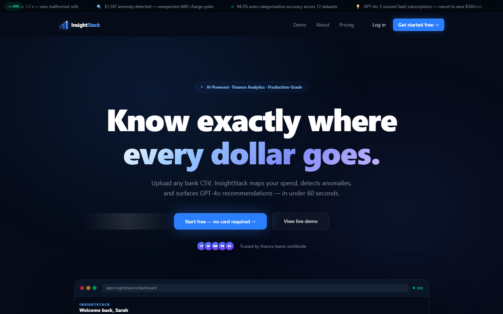
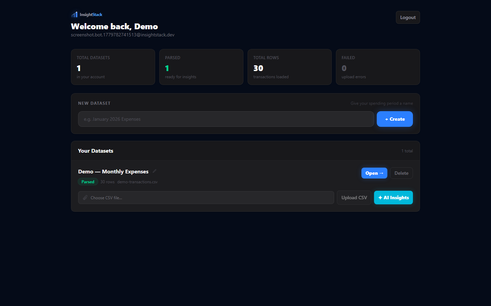
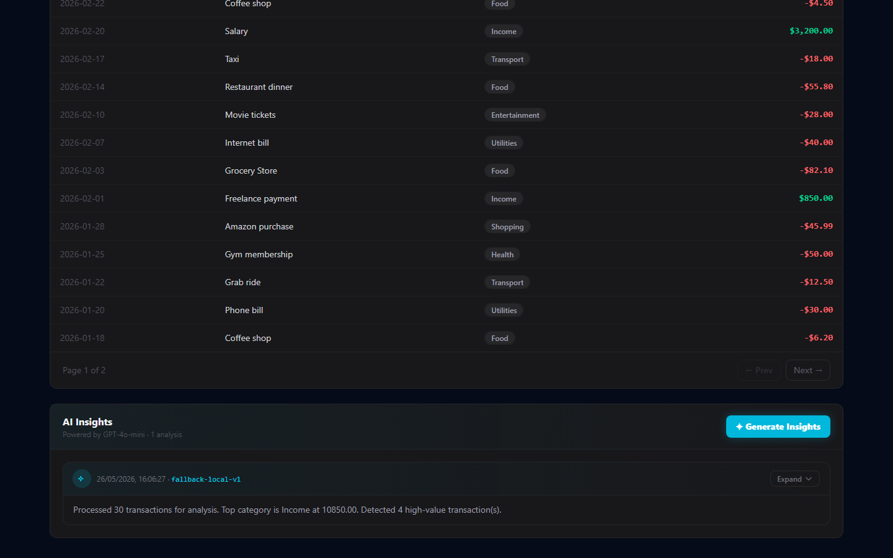
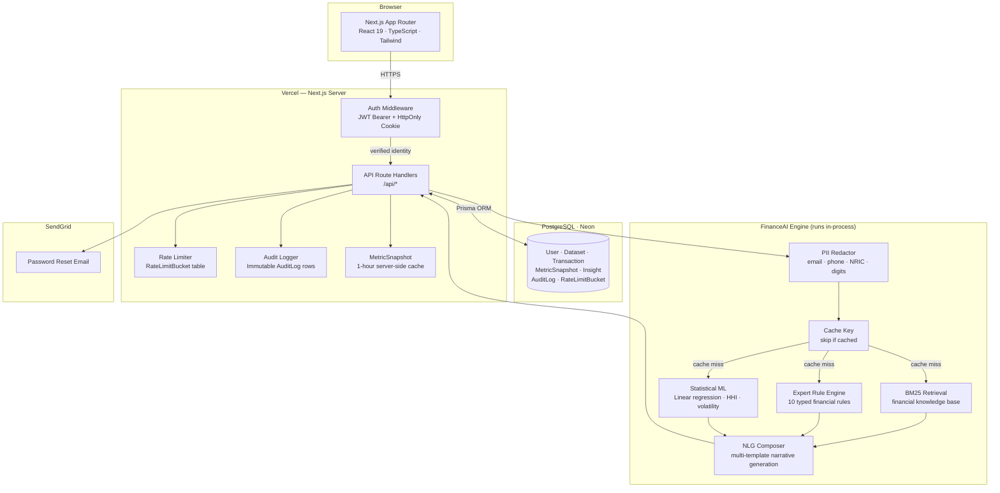

# InsightStack — AI-Powered Finance Analytics

> Upload your transactions. Understand your spending. Get AI-driven recommendations.

[](https://github.com/anishonly121/insightstack-blueprint/actions/workflows/ci.yml)


InsightStack is a **production-grade full-stack SaaS** that turns raw CSV bank exports into a visual financial dashboard with AI-powered spending insights. The AI layer is a custom-built engine — BM25 information retrieval, linear regression, an expert rule system, and intent-based chat — with zero external AI API dependency. Built end-to-end with real auth, real payments, 29 integration tests and a Playwright E2E suite — no mocks.

**[Live Demo →](https://insightstack-peach.vercel.app)** · **[How It Works](https://insightstack-peach.vercel.app/demo)** · **[Changelog](https://insightstack-peach.vercel.app/changelog)**

[](https://vercel.com/new/clone?repository-url=https%3A%2F%2Fgithub.com%2Fanishonly121%2Finsightstack-blueprint&root-directory=app)

---

## Why I built this

Most finance apps that offer AI insights require you to connect your bank account via OAuth — giving a third-party service live read access to your transactions in exchange for a spending report.

InsightStack takes the opposite approach: export a CSV from your bank (something every bank supports, no credentials required), upload it, and get the same quality analysis. Your banking credentials never leave your bank. Your transaction data only lives in your own database.

That constraint forced better engineering. A parser that handles any CSV format. A metrics engine that computes everything server-side. And instead of calling OpenAI, I built the entire AI layer from scratch — BM25 retrieval (the same algorithm powering Elasticsearch), linear regression for trend detection, the Herfindahl-Hirschman Index for spending concentration, and an intent-based chat engine. Zero API cost, zero latency, data never leaves the server.

---

## Table of Contents

- [Screenshots](#screenshots)
- [How It Works](#how-it-works)
- [Architecture](#architecture)
- [Engineering Highlights](#engineering-highlights)
- [Design Tradeoffs](#design-tradeoffs)
- [Tech Stack](#tech-stack)
- [Features](#features)
- [Database Schema](#database-schema)
- [API Reference](#api-reference)
- [Getting Started](#getting-started)
- [Running Tests](#running-tests)
- [Deployment](#deployment-vercel--neon)
- [Project Structure](#project-structure)

---

## Screenshots

> **[Try the live app →](https://insightstack-peach.vercel.app)** — sign up free, upload `docs/demo-transactions.csv`, and generate AI insights in under 60 seconds.

| Landing Page | Dashboard | AI Insights |
|---|---|---|
|  |  |  |

---

## How It Works

| Step | What Happens |
|------|-------------|
| 1. Register / Login | JWT-authenticated account with HttpOnly cookie support |
| 2. Create a Dataset | Named container for a CSV upload |
| 3. Upload CSV | Parse, validate, and store transaction rows in PostgreSQL |
| 4. View Dashboard | Income vs. expenses, savings rate, monthly bar chart, category pie chart |
| 5. Search Transactions | Filter by category or search description with server-side pagination |
| 6. Generate AI Insights | FinanceAI analyses spending — returns summary, anomalies, top categories, 3 recommendations |

---

## Architecture



---

## Engineering Highlights

These are the design decisions that go beyond a typical tutorial project:

**Custom AI engine (no external API)** — The entire AI layer (`src/lib/ai/`) is built from scratch. BM25 (the probabilistic retrieval algorithm powering Elasticsearch) retrieves the most contextually relevant financial knowledge documents for each user's situation. Linear regression detects spending trends. The Herfindahl-Hirschman Index (used by the DOJ for antitrust) measures spending concentration. A typed expert rule engine evaluates 10 financial rules with confidence scores. An NLG composer selects from multiple narrative templates based on financial health profile. Zero external API calls, zero latency, data never leaves the server.

**MetricSnapshot caching** — Analytics are computed server-side once and stored as a `MetricSnapshot` row in PostgreSQL with a 1-hour TTL. Subsequent dashboard loads read directly from the snapshot instead of re-aggregating thousands of transaction rows on every request.

**DB-backed rate limiting without Redis** — A `RateLimitBucket` table (keyed by action + user ID + IP) handles per-user and per-IP rate limits with opportunistic row cleanup. No external queue or cache dependency required.

**Dual auth strategy** — Every protected route accepts both a `Bearer` JWT header *and* an HttpOnly cookie simultaneously. API clients use the header; browser page navigations use the cookie. The same middleware handles both without duplication.

**Real integration tests** — Tests spawn an actual `next start` process, poll `/api/health` until ready, and run against a live PostgreSQL database. No mocks. This caught real regressions during development that unit tests would have missed (e.g., Prisma query shape changes, JSON serialisation edge cases).

**Immutable audit log** — Every sensitive action (upload, rename, delete, insight generate) appends a row to `AuditLog`. Rows are never updated or deleted. The daily insight quota is enforced by counting AuditLog entries rather than a mutable counter that could drift under concurrent requests.

**Typed AI output boundaries** — The FinanceAI engine returns a fully-typed `EngineOutput` object. Because the engine runs in-process, there is no network boundary, no schema mismatch, and no rate limit. The same Zod schemas are used for both HTTP request validation and AI output validation where applicable.

**Structured JSON logging** — All API-layer errors and key events (`INSIGHTS_PROMPT_STATS`, `RATE_LIMIT_CLEANUP_ERROR`, etc.) are emitted via a typed logger that outputs JSON in production (for log aggregators) and human-readable lines in development. Correlation IDs flow through every log entry.

**Playwright E2E suite** — Beyond the 29 integration tests, a Playwright browser-level suite drives the full user journey: landing page → register → create dataset → upload CSV → verify PARSED status → navigate to dataset detail. Runs headlessly against localhost or the live deployment.

**URL-based SSL detection** — Rather than branching on `NODE_ENV` (which is `'production'` in CI too), SSL is detected by checking the connection string for `'localhost'` — a more reliable signal across local, CI, and production environments.

---

## Design Tradeoffs

Every architectural decision has a cost. These are the ones worth discussing in an interview:

**PostgreSQL for rate limiting instead of Redis** — Adds one write per rate-limited endpoint. Acceptable at this scale and eliminates a Redis dependency. At >1k concurrent users, the `RateLimitBucket` table becomes a write bottleneck and Redis would be the right call.

**No mock tests** — Integration tests are slower (30–60s total) and require a live database. This is deliberate. Mocks test that your mock matches your expectations, not that your code works. A real test caught a Prisma query-shape regression mid-development that a unit test would have silently passed.

**MetricSnapshot instead of live aggregation** — Computing dashboard metrics on every page load means scanning all `Transaction` rows per request. The 1-hour snapshot cache trades freshness for constant-time reads. Acceptable for personal finance (yesterday's data is fine); wrong for trading dashboards.

**JWTs instead of server-side sessions** — Sessions require shared state (Redis or a DB table). JWTs are stateless and work naturally across Vercel's serverless functions with no coordination. The tradeoff: tokens can't be revoked before expiry. Mitigated by short TTLs and the HttpOnly cookie path clearing on logout.

**Daily insight quota via AuditLog counting** — Rather than a mutable `insightCount` column that could go wrong under concurrent requests, the quota is enforced by counting immutable AuditLog rows. The count is always accurate; there's no race condition; the log is a useful audit trail regardless.

**Structured AI output** — The FinanceAI engine always returns a typed `EngineOutput` object validated by TypeScript. Because the engine runs in-process rather than calling an external API, there is no network failure mode, no schema mismatch, and no rate limit. The output is deterministic: identical input always produces the same analysis.

---

## Tech Stack

| Layer | Technology |
|-------|-----------|
| Framework | Next.js 16 (App Router, TypeScript) |
| Database | PostgreSQL via [Neon](https://neon.tech) |
| ORM | Prisma 7 |
| Auth | JWT + bcryptjs + HttpOnly cookies |
| Validation | Zod (request bodies + AI response schema) |
| CSV Parsing | Papa Parse |
| Charts | Recharts (Pie, Bar, Line) |
| Styling | Tailwind CSS v4 |
| AI | FinanceAI (custom engine — BM25, linear regression, HHI, expert rules, NLG) |
| Email | SendGrid (password reset) |
| Testing | Node.js built-in test runner (29 integration tests) |
| CI | GitHub Actions (lint + type-check + build + migrate + 29 integration tests) |
| E2E | Playwright (8 tests — auth flow, upload, dataset detail) |
| Deployment | Vercel |

---

## Features

### Authentication
- Register, login, logout, forgot password, reset password via email
- JWT signed tokens + HttpOnly cookie auth (both supported simultaneously)
- bcrypt password hashing (10 rounds)
- Enumeration-safe forgot-password response (same response whether email exists or not)
- Role-based access control: `USER` / `ADMIN`

### Dataset Management
- Create, list (paginated), view, rename, delete datasets
- CSV upload with row-level validation — bad rows skipped, good rows inserted atomically via Prisma transactions
- Dataset status: `UPLOADED` → `PARSED` / `FAILED`

### Analytics & Metrics
- Server-computed `MetricSnapshot` per dataset: total income, total expenses, net savings, savings rate, avg transaction, top categories, monthly breakdown
- Results cached for 1 hour — no redundant aggregation queries
- Three charts: category pie, monthly income/expense bar, net savings trend line
- One-click CSV export of filtered transactions

### AI Insights (FinanceAI — no external API)
- **BM25 retrieval** — Elasticsearch-class probabilistic ranking over a 38-document financial knowledge base; retrieves the most contextually relevant advice per user situation
- **Linear regression** — OLS slope over monthly expense data for trend detection (increasing / decreasing / stable)
- **Herfindahl-Hirschman Index** — measures spending concentration; adapted from the DOJ antitrust metric
- **Expert rule engine** — 10 typed financial rules (deficit, savings rate, concentration risk, anomaly count, trend direction) each with a confidence score
- **NLG composer** — 3 summary templates selected by financial health profile; context-aware category and anomaly reasons
- **Intent-based chat** — keyword-scored intent detection with referential pronoun resolution; answers questions about categories, savings rate, anomalies, monthly trends
- Results cached by data hash — identical input skips recomputation
- Daily quota of 30 insights per user (enforced via AuditLog counting)
- Zero API cost, zero external latency, data never leaves the server

### Security
- CSP, X-Frame-Options, X-Content-Type-Options, Referrer-Policy, Permissions-Policy, **HSTS** headers
- CSRF enforcement for cookie-authenticated mutations
- JSON body hardening: `415` on wrong Content-Type, `400` on malformed JSON
- Request correlation IDs on all requests and error responses
- Immutable AuditLog for all sensitive actions
- DB-backed rate limiting (no Redis required)

### UX & Polish
- **Toast notification system** — slide-in success/error/warning/info toasts with auto-dismiss, manual close, and stacking support
- **FAQ accordion** — CSS `grid-template-rows: 0fr → 1fr` animation; no max-height snapping
- **Annual / monthly pricing toggle** — Pro plan shows `$9/mo` or `$7/mo (billed $84/yr)` with animated "Save 20%" badge; present on both landing page and `/pricing`
- **Drag-and-drop CSV upload** — full drag event handling with visual feedback per dataset card; click-to-browse still works
- **Demo dataset loader** — one-click button in empty dashboard state creates a pre-populated 47-row dataset and uploads it via the real API
- **Keyboard shortcuts panel** — press `?` anywhere on the dashboard; `N` focuses the new dataset input, `←/→` paginate, `Esc` closes
- **Sample CSV download** — hero CTA gives visitors a 47-row realistic demo CSV to try immediately

### SEO & Discoverability
- `robots.txt` via Next.js Metadata API — blocks `/dashboard`, `/admin`, `/api/` from crawlers
- `sitemap.xml` — all 8 public routes with correct priorities and change frequencies

### Admin Panel
- View all users and datasets across the platform
- Admin-scoped dataset deletion
- Accessible only to users with `ADMIN` role

---

## Database Schema

```
User ──< Dataset ──< Transaction
              └──< MetricSnapshot
              └──< Insight
User ──< AuditLog
User ──< PasswordResetToken
RateLimitBucket (keyed by action + user + IP)
```

---

## API Reference

### Auth
| Method | Path | Description |
|--------|------|-------------|
| `POST` | `/api/auth/register` | Create account → returns JWT |
| `POST` | `/api/auth/login` | Login → returns JWT + sets HttpOnly cookie |
| `GET` | `/api/auth/me` | Get current user (Bearer or cookie) |
| `PATCH` | `/api/auth/me` | Change password (requires current password) |
| `DELETE` | `/api/auth/me` | Delete account + all data (requires password confirmation) |
| `GET` | `/api/auth/me/quota` | Today's insight usage vs. 30/day limit |
| `POST` | `/api/auth/logout` | Clear auth cookie |
| `POST` | `/api/auth/forgot-password` | Send password reset email |
| `POST` | `/api/auth/reset-password` | Consume reset token, set new password |

### Datasets
| Method | Path | Description |
|--------|------|-------------|
| `POST` | `/api/datasets` | Create dataset |
| `GET` | `/api/datasets` | List datasets (paginated, sorted) |
| `GET` | `/api/datasets/:id` | Get dataset + transaction stats |
| `PATCH` | `/api/datasets/:id` | Rename dataset |
| `DELETE` | `/api/datasets/:id` | Delete dataset (cascades) |
| `POST` | `/api/datasets/:id/upload` | Upload + parse CSV |
| `GET` | `/api/datasets/:id/metrics` | Get computed MetricSnapshot (1hr cache) |
| `GET` | `/api/datasets/:id/transactions` | List transactions (search, filter, paginate) |
| `POST` | `/api/datasets/:id/insights` | Generate AI insight |
| `GET` | `/api/datasets/:id/insights` | List insights (paginated) |

### Admin
| Method | Path | Description |
|--------|------|-------------|
| `GET` | `/api/admin/users` | List all users |
| `GET` | `/api/admin/datasets` | List all datasets |
| `DELETE` | `/api/admin/datasets/:id` | Delete any dataset |

### Other
| Method | Path | Description |
|--------|------|-------------|
| `GET` | `/api/health` | Health check with request ID |
| `GET` | `/api/activity` | Paginated audit log (`?page=&pageSize=`) for current user |

---

## Getting Started

### Prerequisites
- Node.js 18+
- PostgreSQL database — free tier on [Neon](https://neon.tech) or [Supabase](https://supabase.com) works fine

### 1. Clone & install

```bash
git clone https://github.com/anishonly121/insightstack-blueprint.git
cd insightstack-blueprint/app
npm install
```

### 2. Configure environment

Copy `.env.example` to `.env` and fill in your values:

```env
DATABASE_URL="postgresql://<user>:<pass>@<host>-pooler.neon.tech/<db>?sslmode=require"
DIRECT_URL="postgresql://<user>:<pass>@<host>.neon.tech/<db>?sslmode=require"
JWT_SECRET="replace-with-a-32-char-minimum-random-string"
NEXT_PUBLIC_APP_URL="http://localhost:3000"
NEXT_PUBLIC_APP_NAME="InsightStack"
SENDGRID_API_KEY=""
SENDGRID_FROM_EMAIL="your-verified-sender@example.com"
SENDGRID_TEMPLATE_RESET_PASSWORD="d-..."
NODE_ENV="development"
```

> SendGrid keys are optional for local dev — password reset emails will silently no-op.

### 3. Run migrations & seed

```bash
npx prisma migrate dev --name init
npx prisma generate
npx prisma db seed   # creates admin@insightstack.local / Admin12345!
```

### 4. Start dev server

```bash
npm run dev
```

Visit `http://localhost:3000`

### 5. Try with sample data

A ready-made CSV is at `docs/demo-transactions.csv`. Create a dataset, upload it, then click **Generate Insights**.

### CSV format

```csv
date,description,category,amount
2026-01-02,McDonalds,Food,-9.50
2026-01-22,Salary,Income,1200.00
2026-01-25,Phone bill,Utilities,-25.00
```

Negative amounts = expenses. Positive amounts = income.

---

## Running Tests

### Type-check + lint

```bash
npm run type-check   # tsc --noEmit (strict mode)
npm run lint         # ESLint
```

### Integration tests (29)

Tests spawn `next start` against a real PostgreSQL database and run 29 integration tests across auth, datasets, upload, metrics, transaction filtering, insights, rename, and delete. **No mocks.**

```bash
npm run build   # required — tests run against the production build
npm test
```

Tests run against whatever `DATABASE_URL` is set in your environment. A separate test database is recommended.

### E2E tests (Playwright)

End-to-end tests drive a real Chromium browser through the full user journey: landing page, registration, dataset creation, CSV upload, and dataset detail navigation.

```bash
# Against localhost (requires a running server)
npm run build && npm start &
npm run test:e2e

# Against the live deployment
BASE_URL=https://insightstack-peach.vercel.app npm run test:e2e
```

---

## Deployment (Vercel + Neon)

1. Push this repo to GitHub
2. Import into [Vercel](https://vercel.com) — **set the root directory to `app/`**
3. Add all environment variables from `.env` in the Vercel dashboard
4. Run migrations against your production Neon database:
   ```bash
   npx prisma migrate deploy
   ```
5. Deploy — Vercel will run `npm run build` automatically

---

## Project Structure

```
app/
├── src/
│   ├── app/
│   │   ├── page.tsx                    # Landing page (hero, features, pricing, FAQ)
│   │   ├── robots.ts                   # Auto-generated robots.txt
│   │   ├── sitemap.ts                  # Auto-generated sitemap.xml
│   │   ├── layout.tsx                  # Root layout with ToastProvider
│   │   ├── login/                      # Login + register
│   │   ├── dashboard/                  # Main dashboard + dataset detail
│   │   ├── pricing/                    # Standalone pricing page
│   │   ├── about/                      # About page (interactive demos)
│   │   ├── demo/                       # API walkthrough
│   │   ├── admin/                      # Admin panel (ADMIN role only)
│   │   ├── share/[insightId]/          # Public shareable insight page
│   │   ├── privacy/                    # Privacy policy
│   │   ├── terms/                      # Terms of service
│   │   └── api/                        # All API route handlers
│   ├── components/
│   │   ├── LogoMark.tsx                # Animated SVG logo
│   │   └── Toaster.tsx                 # Toast notification system (context + UI)
│   └── lib/
│       ├── ai/                         # FinanceAI engine (zero external API)
│       │   ├── index.ts                #   Public facade — generateInsights, streamInsightSummary, chat
│       │   ├── engine.ts               #   Orchestrator — runs all strategies, composes output
│       │   ├── chat.ts                 #   Intent-based Q&A with referential resolution
│       │   ├── types.ts                #   Shared types (Finding, EngineOutput, ChatContext)
│       │   ├── knowledge/base.ts       #   38-document financial knowledge base
│       │   ├── strategies/bm25.ts      #   BM25 probabilistic retrieval (Elasticsearch algorithm)
│       │   ├── strategies/statistical.ts #  Linear regression, HHI, monthly volatility
│       │   ├── strategies/rules.ts     #   10 expert financial rules with confidence scores
│       │   └── nlg/composer.ts         #   Multi-template natural language generation
│       ├── api.ts                      # Client-side API wrapper + types
│       ├── auth.ts                     # JWT sign/verify + middleware
│       ├── prisma.ts                   # Prisma client singleton
│       ├── rateLimit.ts                # DB-backed rate limiter
│       ├── audit.ts                    # Audit log writer
│       ├── csrf.ts                     # CSRF enforcement
│       ├── mail.ts                     # SendGrid wrapper
│       └── env.ts                      # Validated env vars
├── prisma/
│   ├── schema.prisma                   # Full data model
│   ├── seed.ts                         # Admin user seed
│   └── migrations/                     # Migration history
├── docs/
│   └── demo-transactions.csv           # Sample data for testing
├── tests/
│   ├── auth.integration.test.mjs       # Auth endpoint tests
│   ├── datasets.integration.test.mjs   # Dataset CRUD + upload tests
│   ├── admin.integration.test.mjs      # Admin access control tests
│   └── metrics.integration.test.mjs    # Metrics, filters, insights, rename, delete
├── tests/
│   ├── auth.integration.test.mjs       # Auth endpoint tests
│   ├── datasets.integration.test.mjs   # Dataset CRUD + upload tests
│   ├── admin.integration.test.mjs      # Admin access control tests
│   ├── metrics.integration.test.mjs    # Metrics, filters, insights, rename, delete
│   └── e2e/
│       └── full-journey.test.mjs       # Playwright E2E: auth → upload → detail
└── .github/
    ├── workflows/
    │   └── ci.yml                      # CI: lint + type-check + build + migrate + test
    ├── ISSUE_TEMPLATE/                 # Bug report + feature request templates
    └── PULL_REQUEST_TEMPLATE.md
```

---

## Built by

**Anish Bhole** — Full-stack Software Engineer  
[LinkedIn](https://www.linkedin.com/in/anishbhole/) · [Live Demo](https://insightstack-peach.vercel.app) · [GitHub](https://github.com/anishonly121/insightstack-blueprint)

---

## License

MIT — free to use, fork, and build on.
